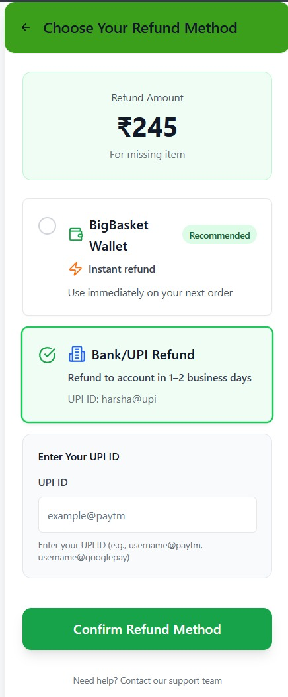

## Refund Us with UPI

This module provides a modern refund experience for BigBasket-style grocery delivery, allowing users to receive refunds directly to their UPI ID.

### Features
- UPI refund page for quick and secure refunds
- Modern UI (React, Tailwind CSS)
- Demo and image included

---

### Code Deploy & Execute

1. **Install dependencies**
	- Use [pnpm](https://pnpm.io/) for best results:
	  ```sh
	  pnpm install
	  ```
	- Or use npm:
	  ```sh
	  npm install
	  ```

2. **Run the development server**
	```sh
	pnpm run dev
	# or
	npm run dev
	```
	The app will be available at `http://localhost:5173` (default Vite port).

3. **Build for production**
	```sh
	pnpm run build
	# or
	npm run build
	```
	The static site will be generated in the `build/v6` folder.

4. **View the refund page**
	- Open `build/v6/index.html` in your browser.

---

### Demo



You can also watch the demo video:

<details>
<summary>Click to view demo</summary>

<video src="Demo.mp4" controls width="600"></video>
</details>

---

### Project Structure
- `build/v6/index.html`: Main entry point for the deployed app
- `image.png`: Screenshot of the refund page
- `Demo.mp4`: Demo video of the refund flow
- `workspace/`, `shadcn-ui/`, `src/`: Source code and UI components

---

### Technologies Used
- React
- TypeScript
- Tailwind CSS
- Vite

---

For more details, see the project wiki or contact the author.
